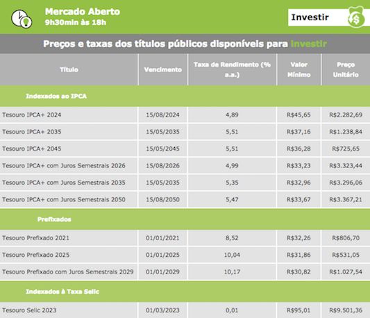

```{r setup, include=FALSE}
knitr::opts_chunk$set(cache = TRUE, message = FALSE, warning = FALSE, fig.path = 'figures/')
```

```{r echo=FALSE, cache=FALSE}
library(tidyverse)
library(ggplot2)
library(xts)
```

# Agenda

- Fontes de dados financeiros disponíveis na Internet
    - Pacotes para importar dados no R

- Manipulação de dados
    - Estrutura de dados no R para trabalhar com dados financeiros

- Visualização de dados
    - Formas simples de visualização de séries temporais

---

# Pacotes no R para acesso a dados

**Fontes de dados nacionais**

- [rbcb](https://cran.r-project.org/package=rbcb): Portal de dados abertos do BCB ([link](https://dadosabertos.bcb.gov.br/))
- [GetTDData](https://cran.r-project.org/package=GetTDData): Dados do Tesouro Direto ([link](http://www.tesouro.gov.br/tesouro-direto-balanco-e-estatisticas))
- [GetDFPData](https://cran.r-project.org/package=GetDFPData): Demostrativos financeiros de empresas listadas na B3 ([link](http://www.bmfbovespa.com.br/pt_br/produtos/listados-a-vista-e-derivativos/renda-variavel/empresas-listadas.htm))
- [GetHFTData](https://cran.r-project.org/package=GetHFTData): Dados de negociações em alta frequência da B3
<!-- - [GetITRData](https://cran.r-project.org/package=GetITRData): Informações Trimestrais das empresas listadas na B3 ([link](http://www.bmfbovespa.com.br/pt_br/produtos/listados-a-vista-e-derivativos/renda-variavel/empresas-listadas.htm)) -->
- [BETS](https://github.com/nmecsys/BETS): Brazilian economic time series

**Fontes de dados internacionais**

- [Quandl](https://cran.r-project.org/package=Quandl): The world’s most powerful data lives on Quandl ([link](http://www.quandl.com)).
- [quantmod](https://cran.r-project.org/package=quantmod): Framework para modelagem em finanças quantitativas.

---

layout: true

# Exemplos

---

```{r fig.height=3.5, fig.width=10}
IBOVESPA <- rbcb::get_series(c(IBOVESPA = 7),
                             last = 756,
                             as = "xts")
autoplot(IBOVESPA)
```

---

```{r fig.height=3.5, fig.width=10}
IPCA <- rbcb::get_series(c(IPCA = 433),
                         start_date = "2003-01-01",
                         end_date = "2017-12-31",
                         as = "xts")
autoplot(IPCA)
```

---

```{r fig.height=3.5, fig.width=10}
SER <- rbcb::get_series(c(INADIMPLÊNCIA = 21082, SPREAD = 20783),
                         as = "xts")
autoplot(do.call(merge.xts, SER)) + facet_free()
```

.footnote[Referência: <https://analisemacro.com.br/economia/politica-monetaria/inadimplencia-vs-spread-bancario-refutando-ideias-heterodoxas/>]

---

```{r fig.height=3.5, fig.width=10}
SELIC <- rbcb::get_series(c(SELIC = 1178),
                          start_date = "2003-01-01",
                          as = "xts")
autoplot(SELIC)
```

---

```{r eval=FALSE}
library(GetTDData)
ntnb <- read.TD.files(asset.codes = "NTN-B",
                      maturity = c("150820", "150850"))
ggplot(ntnb, aes(x = as.Date(ref.date), y = price.bid,
                 color = asset.code)) +
  geom_line() + labs(x = "Datas", y = "Preços", colour = NULL)
```
```{r fig.height=3.5, fig.width=10, echo=FALSE}
load("TD.RData")
ggplot(ntnb, aes(x = as.Date(ref.date), y = price.bid, color = asset.code)) +
  geom_line() + labs(x = "Datas", y = "Preços", colour = NULL)
```

---

```{r fig.height=3.5, fig.width=10}
library(BETS)
DESEMPREGO_SP <- BETS.get(10782)
autoplot(DESEMPREGO_SP)
```

---

```{r fig.height=3.5, fig.width=10}
PIB <- BETS.get(c(1221,1216)) # PIB SERVIÇOS, INDÚSTRIA -- IBGE
SER <- do.call(merge.xts, purrr::map(PIB, as.xts))
names(SER) <- c("SERVIÇOS", "INDÚSTRIA")
autoplot(SER, facets = NULL) + labs(title = "PIB", colour = NULL)
```

---

```{r fig.height=3.5, fig.width=10}
US_YIELD_10Y <- Quandl::Quandl("USTREASURY/YIELD.9",
                           type = "xts",
                           start_date = "2015-01-01")
autoplot(US_YIELD_10Y)
```

---

```{r fig.height=3.5, fig.width=10}
library(quantmod)
getSymbols("^DJI", src = "yahoo", from = "2005-01-01")
Cl(DJI) %>% autoplot()
```

---

```{r fig.height=3.5, fig.width=10}
library(quantmod)
getSymbols(c("GOOG", "AAPL"), src = "yahoo", from = "2004-08-01")
autoplot(merge(GOOG = Cl(GOOG), AAPL = Cl(AAPL))) + facet_free()
```

---

layout: false
class: inverse
background-image: url(figures/meme-desconfiado.jpg)
background-size: 100%
<!-- background-position: 50% 50% -->

.footnote[Imagem: http://www.championdog.com.br/seu-cao-te-ignora/cachorro-desconfiado-destaque/]
---

# O que vamos fazer?

#### Importar dados com os pacotes:

- [rbcb](https://cran.r-project.org/package=rbcb): Dados de índices, moedas, e inflação

- [GetTDData](https://cran.r-project.org/package=GetTDData): Dados de preços e taxas dos contratos

<!-- - [GetDFPData](https://cran.r-project.org/package=GetDFPData): Dados de resultados das empresas -->

- [quantmod](https://cran.r-project.org/package=quantmod): Séries temporais de índices e ações

- [Quandl](https://cran.r-project.org/package=Quandl): Indicadores econômicos de vários paises

--

#### Manipular dados com os pacotes:

- tibble

- dplyr

- xts

- tidyquant

---
layout: false
class: inverse, middle, center

# rbcb

Dados do Banco Central do Brasil

<https://www3.bcb.gov.br/sgspub>

---

# rbcb

[SGS]:https://www3.bcb.gov.br/sgspub
[dadosabertos-bcb]:https://dadosabertos.bcb.gov.br/

- Captura dados utilizando a API RESTful do Banco Central do Brasil (BCB) disponível no [Portal de Dados Abertos do BCB][dadosabertos-bcb]
--

- As séries estão disponíveis em diversos formatos e *endpoits*: JSON, CSV, XML
--

- Muitas séries são encontradas no [Sistema Gerenciador de Séries Temporais do BCB][SGS] (SGS)
    - Atividade Econômica: contas nacionais, indústria, mercado de trabalho
    - Economia Regional: Finanças públicas, coméricio exterior, entre outras séries para as regiões do Brasil, por estados.
    - Expectativas de Mercado: taxas de juros, índices, moedas
    - Economia Internacional: taxas de juros de moedas estrangeiras, balança comercial, indicadores de atividade econômica
    - Finanças Públicas: dívida líquida do setor público, dívida mobiliária federal, receitas dos estados e municípios

---

# rbcb

## `rbcb::get_series`

- Baixa as séries do [SGS]

```{r}
args(rbcb::get_series)
```

--
<br/>
<br/>
.alert[
O `code` das séries é obtido no [SGS]
]

---

class: center, bottom, inverse
background-image: url(figures/SGS.png)
background-size: 100%
background-position: 50% 50%

---

<!-- class: center, bottom, inverse -->
background-image: url(figures/meme-mãonamassa.png)
background-size: 100%
<!-- background-position: 50% 50% -->

---

layout: true

# rbcb

---

## Atividade: Buscando uma série e obtendo os seus dados

- visite o site do SGS https://www3.bcb.gov.br/sgspub
- realize uma busca pelo termo `CDI`\* no campo **Pesquisa textual**
- encontre a série:
    - Nome: Taxa de juros - CDI
    - Unidade: %a.d.
    - Periodicidade: diária
- complete o código abaixo para obter a série e inspecioná-la

```r
cdi_daily <- rbcb::get_series(___, last = 21)
tibble::glimpse(cdi_daily)
```

.footnote[Referência: CDI—Certificado de Depósito Interbancários <http://bit.ly/taxacdi>]

---

## Nomeando as variáveis

O nome da colula com a variável é o código da série, `12`.

``` r
tibble::glimpse(cdi_daily)
#> Observations: 21
#> Variables: 2
#> $ date <date> 2018-04-12, 2018-04-13, 2018-04-16, 2018-04-17, 2018-04-...
#> $ `12` <dbl> 0.024583, 0.024583, 0.024583, 0.024583, 0.024583, 0.02458...
```

- É melhor ter nomes de variáveis válidos: facilita a manipulação.
- Use vetores nomeados em `rbcb::get_series` para nomear as séries.

```r
rbcb::get_series(c(NOME = 999))
```

---

## Atividade: Nomeando as variáveis

- complete o código abaixo para que retorne uma série com a variável nomeada como `CDI`
- use o argumento `last` para retornar os últimos 252 dias (1 ano em dias úteis)

```r
cdi_daily <- rbcb::get_series(___, ___)
tibble::glimpse(cdi_daily)
```

outra forma de inspecionar

```r
str(cdi_daily)
```
---

## Objetos tibble

[tidyverse]:https://www.tidyverse.org/
[dplyr]: https://dplyr.tidyverse.org/

- `rbcb::get_series` retorna um objeto do tipo `tibble` com os dados.
- `tibble` são `data.frame` com esteróides e são ideais pra se trabalhar com funções do [dplyr].

```{r}
rbcb::get_series(c(CDI = 12), last = 5)
```

---

## Objetos tibble

- manipulando variáveis em um objeto tibble: função `mutate`

```{r}
library(dplyr)

cdi_daily <- rbcb::get_series(c(CDI = 12), last = 3)

cdi_daily %>% mutate(fator_cap = 1 + CDI)
```

---

## Atividade: Trabalhando com os dados

- As taxas de juros em `cdi_daily` (`code = 12`) são diárias.
- É comum trabalhar com taxas de juros anuais.
- A fórmula $r_a = (1 + r_d)^{252} - 1$ converte taxas de juros diárias $r_d$ para anuais $r_a$.

<hr/>

- complete o código para fazer a conversão da taxa de juros diária para juros anuais e visualize os dados.

```r
library(dplyr)
library(ggplot2)

cdi_annual <- cdi_daily %>% mutate(CDI = ___)

ggplot(cdi_annual, aes(x = date, y = CDI)) + geom_line()
```

---

## Outras estruturas de dados

- `tibble` são bons para o `dplyr`, mas há outros objetos no R para manipular dados.

- O argumento `as` de `rbcb::get_series` define o tipo retornado.

    - `as` suporta: `tibble`, `data.frame`, `xts`, `ts`, `text`

- `ts` e `xts` são muito utilizados em análise de séries temporais.

--

```{r}
rbcb::get_series(c(IPCA = 433), last = 12, as = "ts")
```

---

## Atividade: Outras estruturas de dados

- complete o código para baixar a série do dólar
    - use `code = 1` com nome `USDBRL`
    - data inicial `2003-01-01` até o fim do ano passado (argumentos `start_date` e `end_date`)
    - retorne um objeto do tipo xts

```r
usdbrl_daily <- rbcb::get_series(___, start_date = ___,
                                 end_date = ___, as = ___)
autoplot(usdbrl_daily)
```

---

## Objetos xts

- objetos xts são séries temporais, logo, são indexados por data

```{r}
rbcb::get_series(c(USDBRL = 1), last = 5, as = "xts")
```

---

## Objetos xts

- objetos xts são idexados por datas no formato ISO `YYYY-MM-DD HH:MM:SS`

```{r}
usdbrl <- rbcb::get_series(c(USDBRL = 1), last = 756, as = "xts")

usdbrl_2016 <- usdbrl["2016"]                 # todo 2016

usdbrl_2016_and_beyond <- usdbrl["2016/"]     # todo 2016 e além

usdbrl_jan_mar_2017 <- usdbrl["201701/03"]    # jan a mar 2017

usdbrl_2017_01_23 <- usdbrl["2017-01-23"]     # 2017-01-23
```

---

## Objetos xts

- objetos xts possuem algumas funções interessantes

```{r}
library(xts)

usdbrl_last_month <- xts::last(usdbrl, "1 months")

usdbrl_first_week <- xts::first(usdbrl, "1 weeks")

usdbrl_monthly <- to.period(usdbrl, on = "months", OHLC = FALSE)

usdbrl_diff <- diff(usdbrl, lag = 1)
```

--

.alert[
use o _namespace_ `xts::` com `last` e `first`
<br/>
elas também são declaradas em `dplyr`
]
---

## Atividade: Obtendo a série mensal do dólar

- O pacote `xts` traz diversas funções que facilitam a manipulação de séries temporais.
- A função `to.period` é indicada para realizar sub amostras das variáveis.

<hr/>

- use a função `to.period` para obter a série mensal do dólar pegando a última cotação de cada mês.
- use `OHLC = FALSE`.

```r
library(xts)
usdbrl_monthly <- to.period(usdbrl_daily, ___, ___)
autoplot(usdbrl_monthly)
```

---

## Atividade: Calculando a variação da série mensal do dólar

- A fórmula da variação é $\Delta x = x_t - x_{t-1}$

<hr/>

- calcule a variação mensal do dólar usando a função `diff` e a variável `usdbrl_monthly`

```r
var_usdbrl_monthly <- ___
autoplot(var_usdbrl_monthly)
```

- execute `head` e `tail` em `var_usdbrl_monthly`
- O que se observa?

---

## Atividade: Correlação dólar x IBOVESPA

Em geral, quando há queda do índice IBOVESPA, há alta do dólar, principalmente em anos eleitorais.
De posse das séries de variações do dólar e do IBOVESPA é possivel calcular a correlação entre estas duas séries e avaliar esta hipótese.

- baixe a série do IBOVESPA (código 7) com a série nomeada IBOVESPA e em um objeto xts
- obtenha a série mensal do IBOVESPA
- calcule a variação mensal do IBOVESPA

```r
ibovespa_daily <- rbcb::get_series(___, start_date = ___,
                                   end_date = ___, as = ___)
ibovespa_monthly <- ___(ibovespa_daily, ___, ___)
var_ibovespa_monthly <- ___
```

---

## Atividade: Correlação dólar x IBOVESPA

- junte as séries de variação com `merge` e visualize com `View()` e `autoplot`

```r
var_monthly <- merge(___, ___, fill = 0)
var_monthly %>% View()
var_monthly %>% autoplot() + facet_free()
```

- veja que o primeiro ponto é `NA`

---

## Atividade: Correlação dólar x IBOVESPA

- remova os `NA`s usando `na.omit`
- visualize os dados limpos com `View` e `autoplot`

```r
var_monthly_clean <- na.omit(var_monthly)
var_monthly_clean %>% View()
var_monthly_clean %>% autoplot() + facet_free()
```

---

## Atividade: Correlação dólar x IBOVESPA

- calcule a correlação entre dólar e IBOVESPA com a função `cor`.
- a seleção das variáveis pode ser feita pela posição das colunas.

```r
cor(var_monthly_clean[,___], var_monthly_clean[,___])
```

- ou pelos nomes das variáveis

```r
cor(var_monthly_clean$___, var_monthly_clean$___)
```

---

## Atividade: Baixando multiplas séries

- Para baixar multiplas séries, forneça multiplos códigos em um vetor.
- Os códigos também podem ser nomeados para nomear as séries.
- A função `rbcb::get_series` retorna uma lista com as séries nos tipos definidos

<hr/>

- baixe as séries de inflação: IGP-M e IPCA, para os últimos 12 meses, utilizando o formato `ts`
- busque os códigos das curvas no site do SGS <https://www3.bcb.gov.br/sgspub>
- visualize as séries

```r
infl <- rbcb::get_series(c(IGPM = ___, IPCA = ___),
                         last = ___, as = ___)
do.call(cbind, infl) %>% as.xts() %>% autoplot()
```

---

exclude: true
## `rbcb::get_currency`

- Baixa as taxas de câmbio divulgadas pelo BCB
    - O BCB coleta e divulga as taxas médias praticadas no mercado interbancário.
    - São 218 taxas de câmbio (em `r format(Sys.Date(), "%d/%b/%Y")`)

```{r}
args(rbcb::get_currency)
```

- Retorna séries de bid (compra) e ask (venda) das taxas de câmbio cotadas em REAL.

---

exclude: true
## Exemplo: séries das taxas de câmbio do Mercosul em dólar

Argentina ARS, Brasil USD, Paraguai PYG e Uruguai UYU e Venezuela VEF
Chile CLP, Bolívia BOB, Peru PEN, Colômbia COP e Equador

```{r}
symbols <- c("ARS", "USD", "PYG", "UYU", "VEF")
# series <- lapply(symbols, rbcb::get_currency, start_date = "2003-01-01", end_date = "2017-12-31")
```

---

layout: false
class: inverse, middle, center

# GetTDData

Dados do Tesouro Direto

<http://bit.ly/tesouro-direto-estatisticas>

---
layout: true

# GetTDData

---

## Dados do Tesouro Direto

- __Tesouro Direto__: plataforma de negociação de títulos públicos federais.
    - <http://www.tesouro.gov.br/tesouro-direto>
- Diariamente títulos públicos federais são negociados no Tesouro Direto (mercado secundário)
- `GetTDData` captura os dados dos títulos públicos federais: preços e taxas, negociados no Tesouro Direto e organiza para manipulação.
    - As planilhas com os dados são baixadas e as funções de `GetTDData` são utilizadas para extrair as informações das planilhas de forma útil e simples.

---

```{r eval=FALSE}
library(dplyr)
library(GetTDData)
asset.codes <- c("LTN", "NTN-B")
download.TD.data(asset.codes = asset.codes)
bonds <- read.TD.files(asset.codes = c("NTN-B", "LTN"),
                       maturity = c("150824", "010121"))
bonds %>% filter(ref.date > "2017-01-01") %>% 
  ggplot(aes(x = as.Date(ref.date), y = yield.bid, color = asset.code)) +
  geom_line() + labs(x = "Datas", y = "Preços", colour = NULL)
```
```{r fig.height=3.5, fig.width=10, echo=FALSE}
load("TD-bonds.RData")
bonds %>% filter(ref.date > "2017-01-01") %>% 
  ggplot(aes(x = as.Date(ref.date), y = yield.bid,
               color = asset.code)) +
  geom_line() + labs(x = "Datas", y = "Taxas", colour = NULL)
```

---

.center[__Títulos disponíveis para investimento no Tesouro Direto__]

.center[]

---

.center[__Códigos dos títulos públicos utilizados no pacote GetTDData__]

Título | Código
-------|-------
Tesouro IPCA+ | NTN-B
Tesouro Prefixado | LTN
Tesouro Prefixado com Juros Semestrais | NTN-F
Tesouro Selic | LFT

---

## Atividade: Importando dados do _Tesouro Prefixado com Jutos Semestrais_

- importe os dados de contratos _Tesouro Prefixado com Jutos Semestrais_ para os vencimentos: 01/01/2021", 01/01/2023, 01/01/2025
- faça um gráfico com os dados de taxas de juros a partir de 2016

```r
library(dplyr)
library(GetTDData)

asset.codes <- c(___)
download.TD.data(asset.codes = asset.codes)
bonds <- read.TD.files(asset.codes = c(___),
                       maturity = c(___))
bonds %>% filter(___) %>% 
  ggplot(aes(x = as.Date(ref.date), y = yield.bid, color = asset.code)) +
  geom_line() + labs(x = "Datas", y = "Taxas", colour = NULL)
```

---

exclude: true
layout: false

class: inverse, middle, center

# GetITRData

Informações Trimestrais de Empresas Listadas na Bolsa

---

exclude: true
layout: true

# GetITRData

---

exclude: true
- Os dados financeiros das empresas estão disponíveis no site da Bolsa—B3.

- `GetITRData` captura os dados disponíveis e os coloca em estruturas de dados de fácil manipulação.

- Informações trimestrais disponíveis:

    - Quantidade de ações emitidas
    
    - Dividendos pagos
    
    - Receita
    
    - Dívidas
    
    - ...
    
---

exclude: true
## Buscando as companhias na Bolsa

```{r}
library(GetITRData)
gitrd.search.company('petrobras')
```

---

exclude: true
## Buscando as companhias na Bolsa

```{r}
gitrd.search.company('itaú')
```

---

exclude: true
## Obtendo todas as companhias da Bolsa

```{r}
companies <- gitrd.get.info.companies(type.data = 'companies')
```

---

exclude: true
```{r}
glimpse(companies)
```

- execute o comando `View(companies)` para visualizar a tabela com as companhias

---

exclude: true
## Obtendo as informações de 1 companhia

```{r}
companies %>% filter(id.company == 19348) %>% glimpse()
```

---

exclude: true
.reduce-code[
```{r}
reports <- gitrd.GetITRData(name.companies = "ITAÚ UNIBANCO HOLDING S.A.", 
                            first.date = "2004-01-01",
                            last.date = "2006-01-01")
```
]

---

exclude: true
```{r}
glimpse(reports)
```

---

exclude: true
## Listando os dividendos pagos

```{r}
glimpse(reports$dividends.history)
```

---

exclude: true
## Visualizando os dividendos pagos

```{r fig.height=3.5, fig.width=10}
reports$dividends.history[[1]] %>%
  filter(type.dividend == "DIVIDENDO") %>%
  select(last.day.with.dividend, dividend.by.price) %>%
  rename(date = last.day.with.dividend, dividend = dividend.by.price) %>%
  ggplot(aes(x = date, y = dividend)) + geom_line() + geom_point() + scale_y_log10()
```

---

exclude: true
## Atividade: Qual o preço das ações no pagamento dos dividendos?

- fazer o gráfico selecionando as variáveis: `last.price`, `last.day.price.with.dividend`

```r
reports$dividends.history[[1]] %>%
  filter(type.dividend == "DIVIDENDO") %>%
  select(___, ___) %>%
  rename(date = ___, price = ___) %>%
  ggplot(aes(x = date, y = price)) +
  geom_line() + geom_point()
```

---

layout: false
class: inverse, middle, center

# quantmod

Modelagem de Finanças Quantitativas

---

layout: true

# quantmod

---

- `quantmod` facilita o acesso a dados financeiros de diversas fontes

    - [Yahoo Finance](https://finance.yahoo.com/): ações, fundos, commodities, e outros ativos de diversos países.

    - [FRED](https://fred.stlouisfed.org): indicadores econômicos

    - [OANDA](https://www.oanda.com): moedas

    - [Tiigo](https://www.tiingo.com/): ações do mercado americano

    - [Alpha Vantage](https://www.alphavantage.co/): ações, moedas, cripto-moedas e moedas digitais.

    - Fontes privadas: MySQL, SQLite, RData, CSV

- O framework tem funções específicas para manipulação e visualização de séries temporais, particularmente úteis para séries de ações.

---

```{r message=FALSE}
getSymbols("AAPL")
head(AAPL, 3)
```

- `getSymbols` importa os dados como um objeto xts.
- O objeto xts é importado para o ambiente, não é necessário atribuir a uma variável.
- `src = "yahoo"` é a fonte de dados padrão.

---

## Importando dados de ações brasileiras

```{r}
getSymbols("ITUB4.SA")
head(ITUB4.SA, 3)
```

- Os símbolos das companhias brasileiras tem sufixo '.SA'

---

## Importando índices de preços

```{r}
getSymbols("^BVSP") # IBOVESPA
head(BVSP, 3)
```

- Os símbolos dos índices tem prefixo '^': ^BVSP, ^DJI, ...

---

## Visualizando os dados

```{r fig.height=4, fig.width=10}
chartSeries(BVSP, type = "candlesticks", theme = "white",
            subset = "201801/", name = "IBOVESPA")
```

---

## Visualizando os dados

```{r fig.height=4, fig.width=10}
chartSeries(BVSP, type = "bars", theme = "black", subset = "201801/",
            major.ticks = "months", name = "IBOVESPA", TA = NULL)
```

---

## Atividade: Importar os dados de companhias brasileiras

- O site da B3 tem informações sobre todas as companhias com ações listadas.
    - <http://www.bmfbovespa.com.br>
    - Link [Empresas Listadas](http://www.bmfbovespa.com.br/pt_br/produtos/listados-a-vista-e-derivativos/renda-variavel/empresas-listadas.htm)

<hr/>

- encontre os símbolos das companhias:
    - Magazine Luiza
    - Localiza
    - Arezzo
- importe os dados destas companhias com `getSymbols`
- faça os gráficos de `candlesticks` com dados desde o começo de 2018 e sem apresentar os dados de volume.

---

layout: false
class: inverse, middle, center

# Quandl

Um marketplace de dados

<https://www.quandl.com/>

---

layout: true

# Quandl

---

- O `Quandl` entrega uma API RESTful para acesso a diversas fontes de dados gratúitas e privadas.

    - Difícil explicar o quanto é bom! Melhor visitar pra ver
    
    - <https://www.quandl.com/>
    
- Tem dados do mundo todo!

- Além de R tem bibliotecas para diversas linguagens: Python, Excel, Ruby, ...

---

## Obtendo dados do PIB dos EUA

```{r}
library(Quandl)
gdp <- Quandl("FRED/GDP")
glimpse(gdp)
```

- Os dados são importados do _FRED - Federal Reserve Economic Data_
- Há uma página com documentação dos datasets no site do Quandl.
    - [link para página de docs do FRED](https://www.quandl.com/data/FRED-Federal-Reserve-Economic-Data/documentation/data-organization)

---

- A função `Quandl` traz diversas facilidades

```{r}
args(Quandl)
```

- `type` permite especificar o tipo de dado retornado. O padrão `raw` retorna um `data.frame`.
- `transform` realiza transformações nos dados - poupa trabalho!
- `collapse` redefine a frequência da amostra
- `order`: é do primeiro para o último ou vice-versa?
- Também há os argumentos: `start_date`, `end_date`

---

## Transformações

- O argumento `transform` realiza algumas transformações simples nos dados.

| Name | Effect	| Formula |
|------|--------|---------|
| none | no effect | z[t] = y[t] |
| diff | 	row-on-row change | z[t] = y[t] – y[t-1] |
| rdiff | 	row-on-row % change | z[t] = (y[t] – y[t-1]) / y[t-1] |
| rdiff_from | latest value as % increment | z[t] = (y[latest] – y[t]) / y[t] |
| cumul | cumulative sum | z[t] = y[0] + y[1] + … + y[t] |
| normalize | scale series to start at 100 | z[t] = y[t] ÷ y[0] * 100 |

.footnote[Fonte: https://docs.quandl.com/docs/parameters-2#section-transformations]

---

.pull-left[
```{r}
gdp <- Quandl("FRED/GDP")

head(gdp, 3)
tail(gdp, 3)
```
]

.pull-right[
```{r}
gdp_d <- Quandl("FRED/GDP",
            transform="diff")
head(gdp_d, 3)
tail(gdp_d, 3)
```
]

---

layout: false
class: inverse, middle, center

# Projetos

Porque a vida é cheia de desafios

---

layout: true

# Projetos

---

## Calcular o IBOVESPA em dólar

- O IBOVESPA é uma carteira de ações negociadas na BOVESPA.

- A cotação do IBOVESPA representa pontos de índice.

- A cotação do dólar é em reais por dólar americano.

- Usando rbcb:

    - importe os dados do dólar e do IBOVESPA desde jan/2010
    
    - calcule o IBOVESPA em dólar
    
    - compare a variação do IBOVESPA em dólar com a sua variação em reais

---

## Calcular série do dólar em candles mensais

- Os preços de ações e índices negociados em bolsa são divulgados em OHCL.

- Os preços do dólar são cotações diárias.

- Usando rbcb:

    - importe os dados do dólar americano desde jan/2010
    
    - gere uma série de preços de dólar com frequência mensal no formato OHCL

---

## Calcular o IBOVESPA deflacionado nos períodos presidenciais

- O IBOVESPA é divulgado diariamente.

- A inflação do IPCA é mensal, do primeiro ao último dia útil do mês.

- Usando rbcb:

    - importe os dados do IBOVESPA e do IPCA
    
    - gere uma série do IBOVESPA mensal
    
    - calcule o IBOVESPA deflacionado
    
    - agregue por períodos dos mandatos presidenciais [link](https://pt.wikipedia.org/wiki/Lista_de_presidentes_do_Brasil)

- Referência: [Variação do IBOVESPA por Governo Federal](http://wilsonfreitas.github.io/posts/variacao-do-ibovespa-por-governo-federal.html)

---

layout: false
class: inverse, middle, center

# Importando e Manipulando Dados Financeiros no R

## Wilson de Freitas

<https://github.com/wilsonfreitas>

